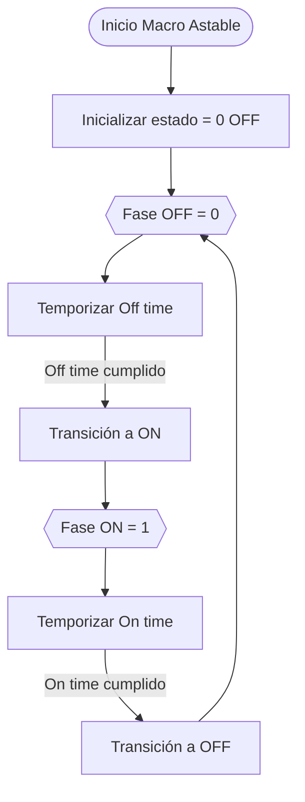

# Astable

> Owner: Mauricio  
> Última actualización: 2026-02-17  
> Notas: Creación del diagrama

```mermaid
flowchart TB
    Start([Inicio Macro Astable]) --> Init[Inicializar estado = 0 OFF]

    %% OFF phase
    Init --> OffState{{Fase OFF = 0}}
    OffState --> TOff[Temporizar Off time]
    TOff -->|Off time cumplido| ToOn[Transición a ON]

    %% ON phase
    ToOn --> OnState{{Fase ON = 1}}
    OnState --> TOn[Temporizar On time]
    TOn -->|On time cumplido| ToOff[Transición a OFF]

    ToOff --> OffState
```