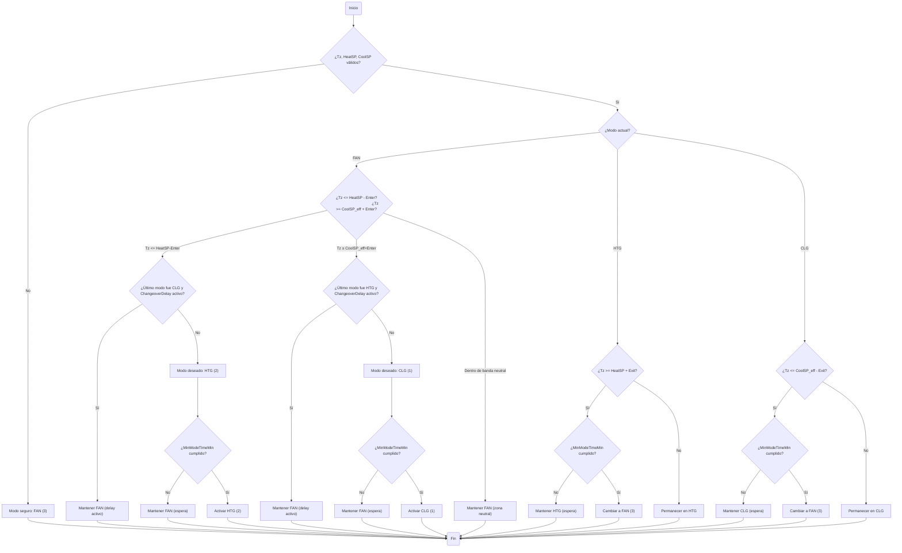

# ZoneAutoModeSelectorHtgClgFan

> Owner: Mauricio  
> Última actualización: 2026-02-09  
> Notas: Creación del diagrama

```mermaid
flowchart TB
    Start("Inicio") --> CheckInputs{"¿Tz, HeatSP, CoolSP válidos?"}
    CheckInputs -- No --> SafeMode["Modo seguro: FAN (3)"]
    SafeMode --> End("Fin")
    CheckInputs -- Sí --> CheckCurMode{"¿Modo actual?"}
    CheckCurMode -- FAN --> FAN_Eval{"¿Tz <= HeatSP - Enter?
                                    ¿Tz >= CoolSP_eff + Enter?"}
    FAN_Eval -- "Tz <= HeatSP-Enter" --> WasCLG{"¿Último modo fue CLG y ChangeoverDelay activo?"}
    WasCLG -- Sí --> StayFAN["Mantener FAN (delay activo)"]
    StayFAN --> End
    WasCLG -- No --> SetHTG["Modo deseado: HTG (2)"]
    SetHTG --> CheckMinModeTimeHTG{"¿MinModeTimeMin cumplido?"}
    CheckMinModeTimeHTG -- No --> StayFAN2["Mantener FAN (espera)"]
    StayFAN2 --> End
    CheckMinModeTimeHTG -- Sí --> HTG["Activar HTG (2)"]
    HTG --> End
    FAN_Eval -- Tz ≥ CoolSP_eff+Enter --> WasHTG{"¿Último modo fue HTG y ChangeoverDelay activo?"}
    WasHTG -- Sí --> StayFAN3["Mantener FAN (delay activo)"]
    StayFAN3 --> End
    WasHTG -- No --> SetCLG["Modo deseado: CLG (1)"]
    SetCLG --> CheckMinModeTimeCLG{"¿MinModeTimeMin cumplido?"}
    CheckMinModeTimeCLG -- No --> StayFAN4["Mantener FAN (espera)"]
    StayFAN4 --> End
    CheckMinModeTimeCLG -- Sí --> CLG["Activar CLG (1)"]
    CLG --> End
    FAN_Eval -- Dentro de banda neutral --> StayFAN5["Mantener FAN (zona neutral)"]
    StayFAN5 --> End
    CheckCurMode -- HTG --> HTG_Eval{"¿Tz >= HeatSP + Exit?"}
    HTG_Eval -- Sí --> CheckMinTimeHTG2{"¿MinModeTimeMin cumplido?"}
    CheckMinTimeHTG2 -- No --> StayHTG1["Mantener HTG (espera)"]
    StayHTG1 --> End
    CheckMinTimeHTG2 -- Sí --> HTGtoFAN["Cambiar a FAN (3)"]
    HTGtoFAN --> End
    HTG_Eval -- No --> StayHTG["Permanecer en HTG"]
    StayHTG --> End
    CheckCurMode -- CLG --> CLG_Eval{"¿Tz <= CoolSP_eff - Exit?"}
    CLG_Eval -- Sí --> CheckMinTimeCLG2{"¿MinModeTimeMin cumplido?"}
    CheckMinTimeCLG2 -- No --> StayCLG1["Mantener CLG (espera)"]
    StayCLG1 --> End
    CheckMinTimeCLG2 -- Sí --> CLGtoFAN["Cambiar a FAN (3)"]
    CLGtoFAN --> End
    CLG_Eval -- No --> StayCLG["Permanecer en CLG"]
    StayCLG --> End
``` 

